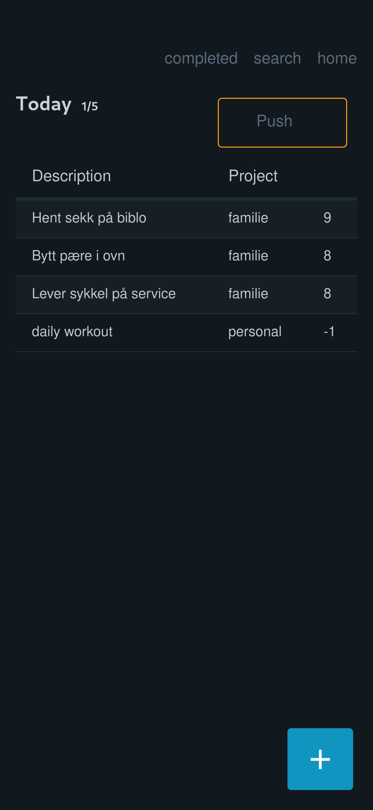

# A Taskwarrior web app

This is a very opinionated frontend for taskwarrior. This is built for me, but if you like it, feel free to use it.

Its reason for existing is that I wanted a simple way to edit taskwarrior tasks on my phone. I have tried a few other ways of doing this, but finally settled on just creating a web frontend to suit my specific needs.

-----

Some specifics you might want to know about:

## Janet

Its a web server written in [Janet](https://janet-lang.org/), and uses [htmx](https://htmx.org/) for interactivity.

Janet is very easy to install and use, and is a [joy](https://joy.swlkr.com/) to work with. I highly recommend it. This currently runs on my raspberry pi in my closet behind a tailscale vpn, and it works great.

## Git

It uses `git` as the "sync" tool, instead of taskwarrior's built in sync with a taskserver. It currently expects the taskwarrior data to be in a git repo at ~/.task.

You have to push the "pull" or "push" button on the home page for changes to be synced to/from the git repo.

## Home page

The home page exists of 2 sections:
- *Inbox* Every task that is not given a project will be present on the home page in the "inbox" section.
- *Today* Tasks that I have scheduled for today or is soon due will be present in the "today" section.

-----------

There are probably other things that should be mentioned here, but I can't think of them right now. Feel free to ask questions in the issues if you have any.

Contributions are welcome :)
